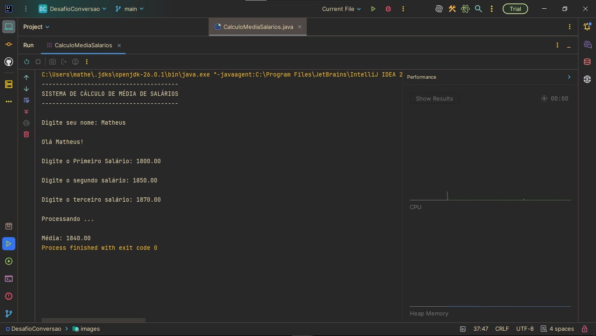

# Cálculo de Média de Salários em Java

Projeto desenvolvido durante meus estudos de **Java** com o objetivo de praticar entrada de dados, conversão de tipos e cálculos básicos utilizando a linguagem.

## Sobre este repositório

Este repositório faz parte da minha jornada de aprendizado em Java. Meu objetivo é documentar os principais exercícios e projetos desenvolvidos ao longo dos estudos, registrando minha evolução na linguagem e construindo um portfólio para oportunidades de estágio e desenvolvimento de software.

## Descrição

O programa solicita o nome do usuário e o valor de três salários (informados inicialmente como `String`). Em seguida, converte os valores para o tipo `double` utilizando o método `Double.parseDouble()`, calcula a média salarial e exibe o resultado formatado com duas casas decimais.

## Tecnologias e conceitos utilizados

- IntelliJ IDEA
- Java
- Scanner
- Locale
- Conversão de `String` para `double`
- `Double.parseDouble()`
- Variáveis e tipos primitivos
- Operadores aritméticos
- Entrada e saída de dados
- Formatação de números com `System.out.printf()`

## Demonstração

<p align="center">
  
</p>

## Estrutura do projeto

```text
java-calculo-media-salarios/
│
├── images/
│   └── printDesafioConversao.jpg
│
├── CalculoMediaSalarios.java
│
└── README.md
```

## Objetivo

Praticar conceitos fundamentais da linguagem Java, especialmente:

- leitura de dados utilizando a classe `Scanner`;
- manipulação de dados do tipo `String`;
- conversão de texto para valores numéricos;
- realização de cálculos com números de ponto flutuante;
- formatação de saída no console.

## Aprendizados

Durante o desenvolvimento deste projeto, pratiquei:

- utilização da classe `Scanner`;
- configuração da localidade com `Locale`;
- conversão de dados utilizando `Double.parseDouble()`;
- manipulação de variáveis e tipos primitivos;
- cálculos utilizando o tipo `double`;
- organização básica de um programa em Java;
- boas práticas de entrada e saída de dados.

## Como executar

Clone este repositório:

```bash
git clone https://github.com/SEU-USUARIO/java-calculo-media-salarios.git
```

Acesse a pasta do projeto:

```bash
cd java-calculo-media-salarios
```

Compile o programa:

```bash
javac CalculoMediaSalarios.java
```

Execute:

```bash
java CalculoMediaSalarios
```

## Autor

**Matheus Ferreira Lopes**

Estudante de Desenvolvimento de Software Multiplataforma (FATEC Diadema)
